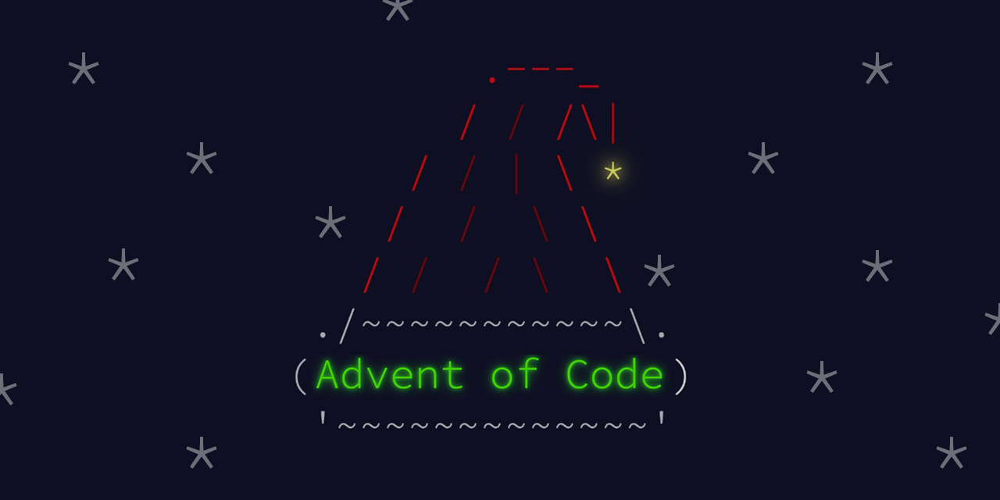

# Advent of Code

Attempts at solving the puzzles of the [Advent of Code](https://adventofcode.com).

P.S. I'm not trying to write beautiful, elegant code that is clean and performant during this competition, I simply try to solve the puzzles with general solutions because it's fun, normally with languages I'm not very familiar with. The code is usually an ugly mess, and so are most of the algorithms I come up with. But as long as the result is right...

## [2020](2020)

* Language: C++
* Result: 50/50 ✅

## [2021](2021)

* Language: Python
* Result: 50/50 ✅

## [2022](2022)

* Language: Python
* Result: 50/50 ✅

## [2023](2023)

* Language: Lua
* Result: 50/50 ✅

## [2024](2024)

* Language: Python
* Result: 50/50 ✅
